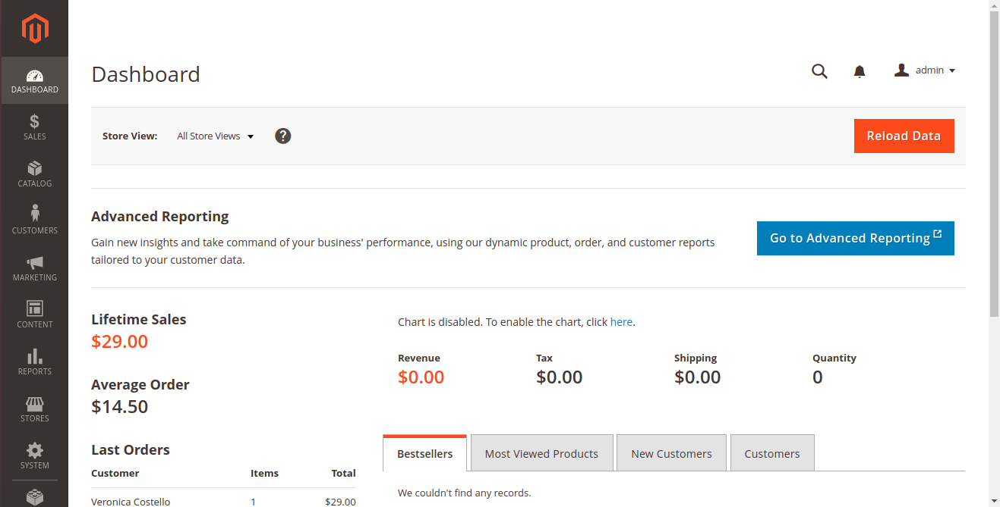

# Magento 2 Ecommerce Chatbot For Google Assistant & Facebook Messenger
We have created this script to turn your Magento 2 website into a chatbot. Users can browse categories, browse products or search for products using this chatbot. No need to install any extension to make it work. Just need API access of Magento 2 website. 

### **Django**

Setup one application with the Django.

### **Magento admin**

Setup you Magento2 store and home page of the Magento admin panel will be look like below.



### **Clone repository**

to clone this repository run:

```

$ git clone https://github.com/pragnakalp/magento2-website-to-chatbot.git

```

### **DialogFlow setup**

To import the dialogflow agent download the zip file of the agent and import this file to dialogflow agent using following steps. Settings(⚙️) > Export and Import > Import From Zip and give path to your dounloaded zip file.

### **Make Below changes**

- Copy code from the views.py file to your Django application's views.py file.
- Copy below code in the urls.py located in your Django project folder. And replace 'magento_app' with the name of your Django app's name.
```
    from django.contrib import admin

    from django.urls import path

    from magento_app import views

    urlpatterns = [

        path('admin/', admin.site.urls),

        path('home/', views.home, name='home'),

        path('webhook/', views.webhook, name='webhook')

    ]
```


- Open admin panel of the Magento 2 and follow system > Integrations > Add New Integration. Fill general information and user identity varification and also access all the APIs. After adding integration, copy Consumer Key, Consumer Secret, Access Token, Access Token Secret.

- Now create one python file with the name variables.py and define below variables in the file.

```

client_key = u"add client key"

client_secret = u"add client secret"

resource_owner_key = u"add resource owner key"

resource_owner_secret = u"add resource owner secret"

base_url = "Give your base URL"

store_name = "## your store name"

app_name = "## your Django app name"

```

- Now files with name df_lib.py and df_facebook.py move to your applications directory.

- Create folder with name 'library' in your django project and download files df_response_lib.py and facebook_template_lib.py from [here](https://github.com/pragnakalp/dialogflow-webhook-response-libary-in-python).

- Files should be in following manner:

```

- Django_project

-- Django_project

-- magento_app

--- df_facebook.py

--- df_lib.py

--- views.py

-- library

--- df_response_lib.py

--- facebook_template_lib.py

-- variables.py

```

For more information on how to use this code, refer our [Tutorial: Magento 2 Ecommerce Chatbot For Google Assistant & Facebook Messenger](https://www.pragnakalp.com/magento-2-ecommerce-chatbot-for-google-assistant-facebook-messenger/)
 
_____

Repository Published by [Pragnakalp Techlabs - Chatbots Development, Natural Language Processing, Machine Learning, Python/NodeJS Solutions](https://www.pragnakalp.com/)